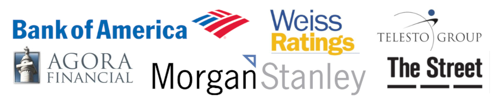

# Writing | Research | Data Science

## Who We Are

Burritt Research is a research and writing firm formed in 2005. We are experts at transforming arcane subjects into engaging content. 

## What We Do

> We specialize in cryptocurrency/blockchain, investments, and data science.  
> We publish regularly on [medium.com](https://medium.com/burritt-research) and other platforms.  
> Please visit our Portfolio below.   

## Solutions

Blog Posts/Articles • Web Content • Marketing Content • White Papers • Data Science  

## Programming Languages

Python • Advanced Excel with VBA • IBM Cognos Analytics • IBM Cloud AI • Git/GitHub • HTML/CSS • SQL  

# Wayne Burritt, CEO  

Wayne loves to help people understand hard-to-understand things. When he’s not writing or coding he likes hanging out with his wife Debi in the mountains of northeast Tennessee and teaching ballet.  

[wburritt@burrittresearch.com](mailto:wburritt@burrittresearch.com?subject=Info)  
[linkedin.com/in/wayneburritt](https://www.linkedin.com/in/wayneburritt 'Wayne Burritt LinkedIn')  
[@burrittresearch](https://twitter.com/burrittresearch/ 'Burritt Research Twitter')  
[Wayne's Resume](https://burrittresearch.com/j-wayne-burritt-resume.pdf "Wayne's Resume")  

# People We've Helped

Bank of America • Big Innovations • Agora Financial • Morgan Stanley • Weiss Ratings  

# Our Portfolio

## Cryptocurrency/Blockchain

[Article Recommending Ethereum](https://burrittresearch.com/wayne-burritt-article-buy-ethereum-today-medium.pdf 'Article Recommending Ethereum')  
[Article on the Impact of Blockchain](https://burrittresearch.com/wayne-burritt-article-blockchain-will-reshape-medium.pdf 'Article on the Impact of Blockchain')  
[Article about Tezos Node Storage](https://burrittresearch.com/wayne-burritt-article-heres-why-tezos-medium.pdf 'Article about Tezos Node Storage')  

## Investments

[Financial Market Blog](https://burrittresearch.com/wayne-burritt-blog-insights.pdf 'Financial Market Blog')  
[Investment Newsletter](https://burrittresearch.com/wayne-burritt-newsletter-agora-emo.pdf 'Investment Newsletter')  
[Equity Research Report](https://burrittresearch.com/wayne-burritt-research-alkame.pdf 'Equity Research Report')  

## Data Science 

[Jupyter Notebook: Data Analysis and Visualization of Restaurants in Johnson City, Tennessee](https://github.com/burrittresearch/restaurants-johnson-city 'Data Analysis and Visualization of Restaurants in Johnson City, Tennessee')  
[Jupyter Notebook: Predicting Home Prices Kaggle Competition](https://github.com/burrittresearch/kaggle-competition-predict-house-prices 'Predicting Home Prices Kaggle Competition')  
[Exploratory Data Analysis Report of Restaurants in Johnson City, Tennessee](https://burrittresearch.com/wayne-burritt-restaurants-jc-report.pdf 'Exploratory Data Analysis Report')  

